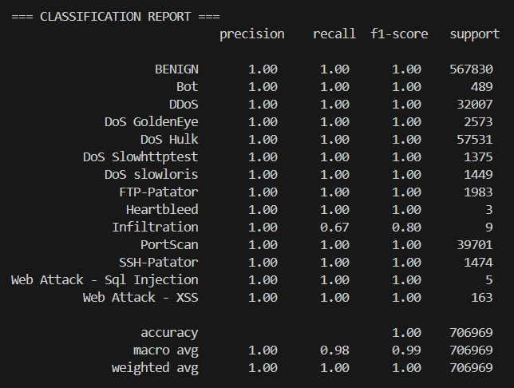

# CICIDS2017-IDS-Simulator

An ML-based Intrusion Detection System (IDS) simulator built using the CICIDS-2017 dataset. This project simulates a multi-class Intrusion Detection System using machine learning on labeled network flow data. It uses XGBoost Model to classify network traffic into various attack types and includes a live inference simulation to showcase real-time detection behavior on unseen, mixed traffic data. 

> This project serves exploratory purposes and was developed as part of academic coursework focused on **Cybersecurity**, **Applied Machine Learning**, and **Data Analytics**.

---

## Table of Contents

- [Project Overview](#project-overview)
- [Key Highlights](#key-highlights)
- [Folder Structure](#folder-structure-in-your-device)
- [Setup Instructions](#setup-instructions)
- [Output Samples](#output-samples)
- [Acknowledgements](#acknowledgements)
- [License](#license)

---

## Project Overview

This simulator detects and classifies multiple types of network intrusions using a supervised machine learning pipeline. The pipeline includes:

- **Data Preprocessing**
- **Model Training with SMOTE**
- **Model Testing with Metrics**
- **Live Simulation on Unseen Samples**

This serves as a clean, baseline framework for learning about IDS pipelines, analyzing attack patterns, and eventually building deployable intrusion detection solutions.

---

## Key Highlights

- 📚 **Dataset**: [CICIDS-2017](https://www.kaggle.com/datasets/chethuhn/network-intrusion-dataset)
- ⚙️ **Model**: XGBoost Classifier with SMOTE to address class imbalance
- 🔀 **Data Split**: 70% training, 25% testing, 5% for live simulation (unbiased)
- 🧼 **Preprocessing**: Label encoding, NaN/Inf handling, correlation heatmap
- 📊 **Reports**: Classification Report, Confusion Matrix, ROC Curve (multiclass)
- 💻 **Live Simulation**: `demo.py` simulates real-time classification
- 🔗 **Modular Scripts**: Each stage is handled by a separate script
- 📁 **Outputs**: Cleaned data, saved model, visual metrics, and final PDF report

---

## Folder Structure in your Device

### 📊 Feature-Selected Workbook (Required)

The pipeline starts from a manually curated Excel workbook `feature_selected_dataset.xlsx` (~393 MB).  
GitHub can’t host a file this large, so grab it from Google Drive:

[Download the workbook from here](https://docs.google.com/spreadsheets/d/1DYT9haevZg3vLJu14RSE7lHSp0czjtzk/edit?usp=sharing&ouid=101696014190707870752&rtpof=true&sd=true)

After download, place the file here:
```
CICIDS2017-IDS-Simulator/
│
├── data/
│   └── feature_selected_dataset.xlsx 
│
├── codes/ 
│   ├── data_cleaning.py
│   ├── model_training.py
│   ├── model_testing.py
│   ├── report_generator.py
│   └── demo.py
│
└──── outputs/ 
```

**Note:**  
> Make sure to manually create an `outputs/` folder in the root directory.  
> All scripts are designed to store their generated files (like cleaned datasets, trained models, plots, and reports) inside this folder.  

---

## Setup Instructions:

1. Install the required Python packages:
Make sure you’re in the root folder (CICIDS2017-IDS-Simulator/), then run:
```bash
pip install -r requirements.txt
```

2. Clean the dataset:
Run the cleaning script to convert the Excel workbook into a cleaned CSV file with label encoding and correlation filtering:
```bash
python codes/data_cleaning.py
```
This will generate:
- `data/cleaned_dataset.csv`
- `outputs/label_encoder.pkl`
- `outputs/label_mapping.json`
- `outputs/correlation_heatmap_after_cleaning.png`

3. Train the model:
Now train the XGBoost model on the cleaned dataset:
```bash
python codes/model_training.py
```
This will save:

- `outputs/train_data.csv`
- `outputs/test_data.csv`
- `outputs/demo_data.csv`
- `outputs/xgb_model.pkl`
- `outputs/training_columns.pkl`

4. Test the model:
Evaluate the trained model on the testing data with detailed metrics:
```bash
python codes/model_testing.py
```
This will generate:

- `outputs/test_data_classification_report.txt`
- `outputs/test_data_confusion_matrix.png`
- `outputs/test_data_roc_multiclass.png`

5. Simulate live inference:
Simulate intrusion detection on unseen test samples in real-time:
```bash
python codes/demo.py
```
This will create:

- `outputs/demo_data_classification_report.txt`
- `outputs/demo_data_confusion_matrix.png`
- `outputs/demo_data_roc_multiclass.png`
- `outputs/demo_data_model_report.pdf`

---

## Output Samples





---

## Acknowledgements

- **[Pranav Chougule](https://github.com/Greatmax-07)** – Led the end-to-end implementation, including model design, feature engineering, training, and reporting
- **[Varad Tanawade](https://github.com/vartan2006)** – Provided critical guidance in correcting the data-splitting strategy, which helped avoid model bias and improved the overall pipeline quality
- **Canadian Institute for Cybersecurity (CIC)** – For publishing the CICIDS-2017 dataset.  
- **OpenAI's ChatGPT** – Provided programming and debugging assistance throughout the pipeline development.

---

## License

This project is licensed under the [MIT License](LICENSE).  
See the LICENSE file for more details.
